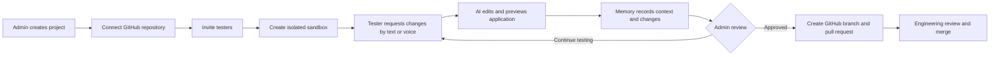
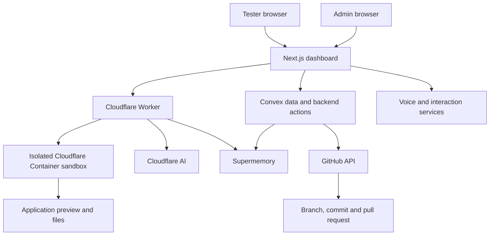

# FDE-Toolkit

## Forward-deployed AI product laboratory

FDE-Toolkit gives product teams and enterprise clients a controlled environment for turning user feedback into working software experiments.

Each tester receives an isolated sandbox. The tester describes changes through text or voice, AI edits the application inside the sandbox, persistent memory retains context, and approved experiments become reviewable GitHub pull requests with generated change histories.

The result is a shorter, more observable path from discovery to validated product change.

## The problem

Traditional product discovery and software delivery are separated by multiple handoffs:

```text
User feedback -> meeting notes -> product interpretation -> ticket -> engineering queue -> implementation -> review
```

Important context is lost at every transition. Users struggle to express what they need, product teams struggle to validate interpretations, and engineers receive requirements without the original interaction context.

FDE-Toolkit brings the user, product, AI, and engineering workflow into one governed loop.

## Product flow



## What FDE-Toolkit demonstrates

- Forward-deployed AI engineering
- Multi-tenant product experimentation
- Isolated execution environments
- Natural-language and voice-driven application changes
- Persistent context and change memory
- GitHub repository import and pull-request automation
- Human review before production integration
- Product discovery connected directly to engineering artifacts

## Core capabilities

| Capability | Description |
|---|---|
| **Project administration** | Connect a codebase, create a testing program, and invite participants |
| **Per-user sandboxes** | Provide isolated filesystems and preview environments for each tester |
| **AI-assisted changes** | Convert natural-language requests into application edits |
| **Voice interaction** | Support speech input, prompt refinement, and spoken responses |
| **Persistent memory** | Preserve tester context, requests, experiments, and change history |
| **Live preview** | Let users inspect and iterate on generated application changes |
| **GitHub integration** | Import repositories, create branches, commit changes, and open pull requests |
| **Change synthesis** | Generate reviewable summaries and changelogs from sandbox history |
| **Admin governance** | Keep project owners in control of what becomes a software change |

## Architecture



### Major components

```text
FDE-Toolkit/
├── worker/        Cloudflare Worker, sandbox API, AI code generation, file serving
├── dashboard/     Next.js application, admin UI, tester dashboard, Convex backend
├── convex/        Schema, mutations, actions, and GitHub integration
└── Dockerfile     Container image used by each sandbox
```

## Enterprise design considerations

A production deployment should treat AI-generated code as untrusted until reviewed and validated. Important controls include:

- Isolation between users, projects, repositories, and sandboxes
- Minimum-privilege credentials for GitHub and external services
- Secret scanning and prevention of credentials entering prompts or generated files
- Limits on files, commands, tools, time, and resource consumption
- Dependency, license, security, and quality checks
- Complete change history and user attribution
- Human approval before opening, merging, or deploying changes
- Clear data retention and deletion policies for user interactions and memory

## Run locally

```bash
npm install
cd worker && npm install
cd ../dashboard && npm install
```

Then run the Worker, Convex, and Next.js dashboard in separate terminals. See the complete [setup and deployment guide](docs/SETUP.md) for service accounts, environment variables, local execution, deployment, and security reminders.

## Core operating flows

### Tester flow

1. Open an assigned sandbox.
2. Request a change through text or voice.
3. Review the live preview.
4. Clarify, correct, or extend the request.
5. Repeat until the experience represents the desired outcome.

### Admin flow

1. Create a project and connect its GitHub repository.
2. Invite testers and monitor experiments.
3. Review sandbox outputs and change histories.
4. Select one or more approved experiments.
5. Create individual or aggregated pull requests for engineering review.

## From prototype to enterprise product

Potential production extensions include:

- Policy-driven repository and tool permissions
- Automated tests and evidence packages before PR creation
- Architecture and coding standards supplied as agent instructions
- Evaluation of generated changes against user intent
- Approval workflows for product, architecture, security, and release roles
- Analytics connecting user experiments to adoption and product outcomes
- Model routing, cost controls, latency controls, and fallback strategies

## Public-safe portfolio note

This public repository should not contain customer data, proprietary client code, protected information, production credentials, or confidential employer assets. Use synthetic applications and appropriately authorized repositories for demonstrations.

## Related work

- [Yooti](https://github.com/amitvikram/yooti-cli), governed agentic software delivery with explicit human gates
- [Proxiom.ai](https://github.com/amitvikram/website-Proxiom.ai), enterprise reasoning and operational AI solutions
